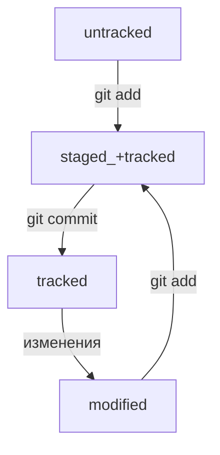

# Git Manual

## Создание репозитория по порядку
```
cd ~ - перемещаемся в рабочий каталог

git config --global user.name YourNAME - создаем глобальное имя 

git config --global user.email YourEMAIL - создаем глобальное email
```
Выбираем папку куда сохранятся эти данные, можно просто нажать ENTER и они сохранятся автоматически в ваш домашний каталог.

Пароль можно тоже не делать, иначе его придется вводить при каждом взаимодействии с репозиторием.
```
ssh-keygen -t ed25519 -C "электронная почта, привязанная к вашему GitHub" - создаем свой SSH ключ

cd .ssh/ - переместились в папку .ssh/

cat id_ed25519.pub - выводим в консоль свой SSH ключ
```
Копируем этот SSH ключ и заходим в настройки GitHub, далее в разделе SSH нажимаем новый ключ SSH, даем ему название, выбираем Authentication Key, и вставляем ниже свой SSH ключ, который скопировали в консоле.
```
mkdir folder_name - создаем папку

cd folder_name - перемещаемся в эту папку   

touch file_name.txt - создаем файл с расширением TXT 

git init - инициализируем локальный репозиторий 

git add --all - добавляем изменения из рабочего каталога в раздел проиндексированных файлов

git commit -m 'YOUR_message' - коммит
```
Далее создаем новый репозиторий на GitHub, можно назвать так же как назвали папку, и копируем ссылку на репозиторий в формате git@github.com:NAME_ACCOUNT/folder_name.git
```
git remote add origin git@github.com:NAME_ACCOUNT/folderName.git - подключаемся к удаленному репозиторию

git push -u origin master - загружаем в удаленный репозиторий файлы из локального
```


## Основные команды

```
cd (~   ..   /)

ls (-a) - list 

pwd - print work directory

cp - copy

mv - move

touch - new file

mkdir - make directory

cat - read file

rm - remove file

rm -r [folderName] - удалить папку и содержимое в ней

rmdir - remove dir

&& - commands together

echo '' >> file.txt - запишет в файл в конце

echo '' > file.txt - перезапишет файл с начала
```

## Основные команды Git
```
git init

git add (--all   .)

git diff - сравнит последнюю закоммиченную версию файла с той, что находится в состоянии modified

git diff --staged - покажет изменения в staged-файлах относительно последних закоммиченных версий

git restore --staged [fileName] (.) - выполнить unstage изменений

git restore [file] - откатить изменения, которые не попали ни в staging, ни в коммит. 
Может быть так, что вы случайно изменили файл, который не планировали. 
Теперь он отображается в Changes not staged for commit (modified). 
Чтобы вернуть всё «как было», можно выполнить команду git restore [file].

git status - проверка статуса

git commit -m 'message'

git commit --amend --no-edit - (--amend - изменить; --no-edit - оставить название коммита прежним)

git commit --amend -m 'NewName' - изменить название коммита

git reset --hard [commit hash] - откатить коммит, все коммиты выше него будут удалены

git push (-u origin master - делается только первый раз)

git log - список коммитов

git log --oneline - получить сокращенный лог

Обратите внимание: если выход из просмотра логов не произошёл автоматически, 
нажмите клавишу Q (от англ. Quit — «выйти») в английской раскладке клавиатуры.

git remote add (name, ssh) - связать удаленный репозиторий с локальным

git remote -v - проверка связи

git clone [URL]

git branch [NAME] - создать ветку

git branch - посмотреть все ветки 

git checkout [NAME] - переключиться на ветку

git checkout -b [NAME] - создать и сразу переключиться на ветку

git merge [название_ветки] - выполнить слияние веток

git branch -D [<название_ветки] - удалить ветку после объединения

git diff [название_ветки1] [название_ветки2] - сравнение двух веток (так же можно использовать master & HEAD)

git diff HEAD~N HEAD (commit~; HEAD~; master~) - разница между коммитом №N с конца и коммитом HEAD (нумерация для ~ начинается с 0)
```

## Git ignore

**.gitignore** - текстовый файл, добавляемый в корень репозитория, хранящий в себе названия файлов, которые нужно игнорировать. Его тоже нужно коммитить. Правила из .gitignore применяются только к новым (untracked) файлам. Если файл уже попал в staging area или в коммит, то правила на него не распространяются.

Если строка начинается с #, то это комментарий.

```
  #для macOS
```

```
  .DS_Store - это название файла, который необходимо игнорировать
```

Символ звёздочки (*) соответствует любой строке, включая пустую.

```
  #игнорировать все файлы, которые заканчиваются на .jpeg
  *.jpeg

  #игнорировать все файлы "tmp" во всех подпапках папки docs
  docs/*/tmp 
```

Вопросительный знак ? соответствует одному любому символу.

```
  file?.txt 
```

Квадратные скобки [], как и вопросительный знак, соответствуют одному символу. При этом символ не любой, а только из списка, который указан в скобках.

```
  file[0-2].txt 
```

Косая черта, или слеш (/), указывает на каталоги. Если шаблон в .gitignore начинается со слеша, то Git проигнорирует файлы или каталоги только в корневой директории.

```
  #игнорировать todo.txt в корне репозитория
  /todo.txt

  #для сравнения: spam.txt будет игнорироваться во всех папках
  spam.txt 
```

Если шаблон заканчивается слешем, то правило применится только к папке.

```
  #игнорировать папку build
  build/
```

Функция парных звёздочек (**) похожа на функцию одинарной (*). Отличие в том, как они работают с вложенными папками. Двойная звёздочка может соответствовать любому количеству таких папок (в том числе нулю). Одинарная может соответствовать только одной.

```
  #игнорировать файлы "docs/current/tmp", "docs/old/tmp", 
  #а также "docs/old/saved/a/b/c/d/tmp" 
  #и даже "docs/tmp", потому что ноль вложенных папок тоже подходит 
  docs/**/tmp

  #игнорировать только "docs/current/tmp" и "docs/old/tmp" 
  #файл "docs/old/saved/a/b/c/d/tmp" не попадает в правило 
  docs/*/tmp 
```

Любое правило в файле **.gitignore** можно инвертировать с помощью восклицательного знака (!).

```
  #игнорировать все JPEG-файлы 
  *.jpeg

  #но только не мем с Doge 
  !doge.jpeg 
```

Игнорируемые файлы не отображаются в выводе команды **git status**, иначе они бы засоряли вывод.

Если всё же нужно отобразить все игнорируемые файлы, то это можно сделать с помощью ключа --ignored: **git status --ignored**. В таком случае в выводе git status появится раздел Ignored files.


## Статусы файлов: 



**untracked** - новый файл не был проиндексирован (git add)

**tracked** - файл был проиндексирован или был закоммичен (git add / git commit)

**staged** - файл был проиндексирован (git add)

**modified** - файл был изменен, но не был проиндексирован (git add)

Файл может быть одновременно **tracked** и **staged**, **staged** и **modified**.

## Выделение текста

Можно выделять текст в markdown с помощью символов `_` или `*`. Например:

Пример _курсива_ и **жирного** текста.

## Заголовки

Заголовки можно создавать с помощью символа `#`. Чем больше `#`, тем меньше заголовок. Например:
----
# Заголовок первого уровня
## Заголовок второго уровня
### Заголовок третьего уровня
----
## Выделение кода

Чтобы выделить текст как код, поместите его в тройные кавычки `````. 

```
mkdir my_project
cd my_project
git init
```
Это лишь некоторые функции markdown.