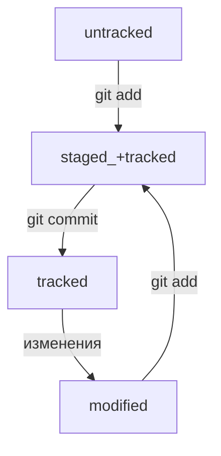

# Git Manual

## Создание репозитория по порядку

cd ~ - перемещаемся в рабочий каталог

git config --global user.name YourNAME - создаем глобальное имя 

git config --global user.email YourEMAIL - создаем глобальное email

Выбираем папку куда сохранятся эти данные, можно просто нажать ENTER и они сохранятся автоматически в ваш домашний каталог.

Пароль можно тоже не делать, иначе его придется вводить при каждом взаимодействии с репозиторием.

ssh-keygen -t ed25519 -C "электронная почта, к которой привязан ваш аккаунт на GitHub" - создаем свой SSH ключ

cd .ssh/ - переместились в папку .ssh/

cat id_ed25519.pub - выводим в консоль свой SSH ключ

Копируем этот SSH ключ и заходим в настройки GitHub, далее в разделе SSH нажимаем новый ключ SSH, даем ему название, выбираем Authentication Key, и вставляем ниже свой SSH ключ, который скопировали в консоле.

mkdir folder_name - создаем папку

cd folder_name - перемещаемся в эту папку   

touch file_name.txt - создаем файл с расширением TXT 

git init - инициализируем локальный репозиторий 

git add --all - добавляем изменения из рабочего каталога в раздел проиндексированных файлов

git commit -m 'YOUR_message' - коммит

Далее создаем новый репозиторий на GitHub, можно назвать так же как назвали папку, и копируем ссылку на репозиторий в формате git@github.com:YourLogin/folder_name.git

git remote add origin git@github.com:YourLogin/folder_name.git - подключаемся к удаленному репозиторию

git push -u origin master - загружаем в удаленный репозиторий файлы из локального


## Основные команды

cd (~   ..   /)

ls (-a) - list 

pwd - print work directory

cp - copy

mv - move

touch - new file

mkdir - make directory

cat - read file

rm - remove file

rmdir - remove dir

&& - commands together

echo '' >> file.txt - запишет в файл в конце

echo '' > file.txt - перезапишет файл с начала

## Основные команды Git

git init

git add (--all   .)

git diff - сравнит последнюю закоммиченную версию файла с той, что находится в состоянии modified

git diff --staged - покажет изменения в staged-файлах относительно последних закоммиченных версий

git restore --staged [fileName] (.) - выполнить unstage изменений

git restore [file] - откатить изменения, которые не попали ни в staging, ни в коммит. Может быть так, что вы случайно изменили файл, который не планировали. Теперь он отображается в Changes not staged for commit (modified). Чтобы вернуть всё «как было», можно выполнить команду git restore [file].

git status - проверка статуса

git commit -m 'message'

git commit --amend --no-edit - (--amend - изменить; --no-edit - оставить название коммита прежним)

git commit --amend -m 'NewName' - изменить название коммита

git reset --hard [commit hash] - откатить коммит, все коммиты выше него будут удалены

git push (-u origin master - делается только первый раз)

git log - список коммитов

git log --oneline - получить сокращенный лог

Обратите внимание: если выход из просмотра логов не произошёл автоматически, нажмите клавишу Q (от англ. Quit — «выйти») в английской раскладке клавиатуры.

git remote add (name, ssh) - связать удаленный репозиторий с локальным

git remote -v - проверка связи

## Статусы файлов:



untracked - новый файл не был проиндексирован (git add)

tracked - файл был проиндексирован или был закомиичен (git add / git commit)

staged - файл был проиндексирован (git add)

modified - файл был изменен, но не был проиндексирован (git add)

Файл может быть одновременно tracked и staged, staged и modified.

## Выделение текста

Можжно выделять текст в markdown с помощью символов `_` или `*`. Например:

Пример _курсива_ и **жирного** текста.

## Заголовки

Заголовки можно создавать с помощью символа `#`. Чем больше `#`, тем меньше заголовок. Например:
----
# Заголовок первого уровня
## Заголовок второго уровня
### Заголовок третьего уровня
----
## Выделение кода

Чтобы выделить текст как код, поместите его в тройные кавычки `````. 

```
mkdir my_project
cd my_project
git init
```
Это лишь некоторые функции markdown.